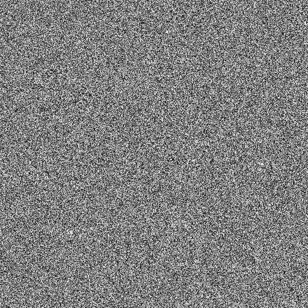
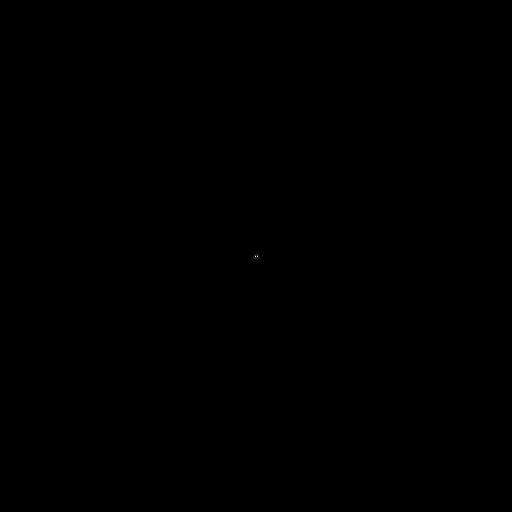

# FFT-Noise
Utilizing 2D Fast Fourier Transforms on 2D vectors/ images to generate 1/f Noise.

## How to Compile & Run
<details>
  <summary><b> Linux & Mac </b> </summary>
  
  ```shell
  git clone https://github.com/IamShubhamGupto/FFT-Noise.git
  cd FFT-Noise
  make 
  ./bin/fft.out beta [path]
  ```  

  <b>EXAMPLE </b>
  
  ```shell
  make 
  ./bin/fft.out 1.7 
  ```

   ```shell
  make 
  ./bin/fft.out 1.7 samples/noise3.png
  ```
  
  Guide:
  
  ```
Usage: ./bin/fft.out beta [path]

beta - roughness factor

path - optional - path to a square input image, dimensions are a power of 2.
  ```
  #### Clean Up
  In order to clean the bin directory, run ```make clean```.

  In order to remove only the generated images, run ``` make cleanimg```.
</details> 

## Results
Original                   |  Filtered Discrete Fourier Transform     | 1/f Noise generated by Inverse Fourier Transform
:-------------------------:|:----------------------------------------:|:------------------------------------------------:
  |                     | 
  |                     | 

## By
- [Shubham Gupta](https://github.com/IamShubhamGupto)
- [Faraz Shaikh](https://github.com/FarazzShaikh)

## References
- [2D FFT](https://github.com/karimnaaji/fft)
- [Link 1](http://paulbourke.net/fractals/noise/)
- [Link 2](https://www3.risc.jku.at/education/courses/ws2016/cas/landscape.html)
- [Link 3](https://web.williams.edu/Mathematics/sjmiller/public_html/hudson/Dickerson_Terrain.pdf)
- [Link 4](http://people.ciirc.cvut.cz/~hlavac/TeachPresEn/11ImageProc/13FourierFiltrationEn.pdf)
- [Link 5](http://www.cs.tut.fi/~moncef/SGN-3016-DIP/Chap04.pdf)
- [Link 6](https://eecs.wsu.edu/~cs445/Lecture_9.pdf)
- [Link 7](http://users.cs.cf.ac.uk/Dave.Marshall/CM0268/PDF/09_CM0268_Frequence_Space.pdf)


