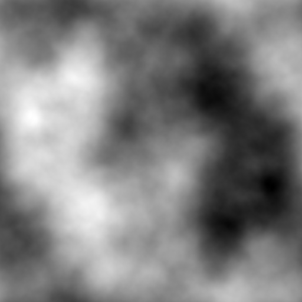
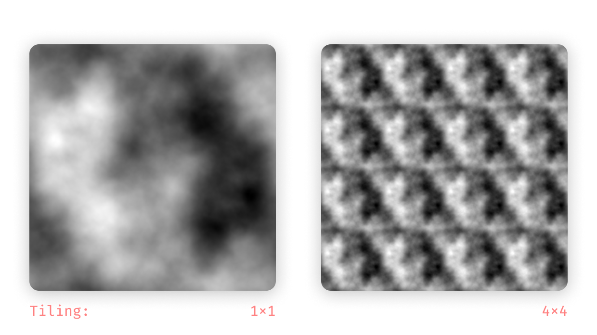
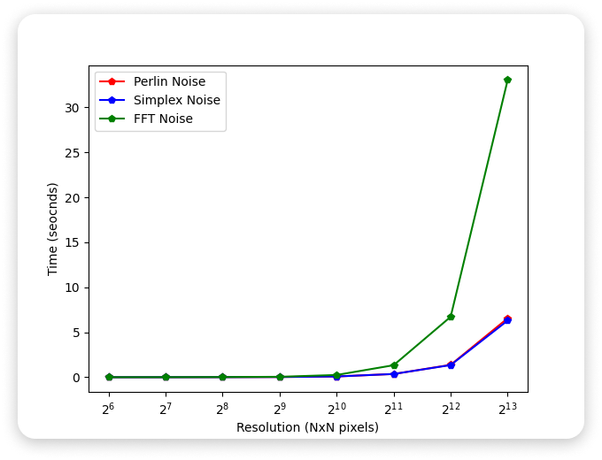

<br />
<p align="center">

  <h1 align="center">FFT-Noise</h1>
  
  <p align="center">
    2D Fractal Noise using Fast Fourier Transforms.
    <br />
    <a href="https://github.com/IamShubhamGupto/FFT-Noise/issues/new">Report Bug</a>
  </p>
</p>

# What is this?

FFT-Noise is an implementation of a method of producing Fractal Noise using Fast Fourier Transforms based on a method described by **Paul Bourke** in his 1997 paper *"Frequency Synthesis of Landscapes (and clouds)"*<sup>1</sup>

It takes in White Noise as input (possibly from an image) and returns FFT-Noise generated from it. The Noise looks something like this:

<p align="center">
     
  <h5 align="center">
    Fractal Noise obtained from <a href="assets/white_noise.png">White Noise</a>. </br> <i>R = 2.4</i>
  </h5>
</p>


This noise can be used in procedural texture and terrain generation.

This algorithm is not meant to be used in production environments as it is slow and has several drawbacks, especially when compared to its contemporaries like Perlin noise-based or Simplex noise-based fBm algorithms.

Some of those drawbacks are:

- It is not Infinite (Non-repeating).
- It is slow (See [benchmarks](#benchmarks)).
- It offers very little control over the output.

However, the only benefit we found was that it was in fact **Infinitely Tilable**. However, since it is **Repeating**, the tiling effect is noticeable.

<p align="center">
    
</p>


# How does this work?

According to _Techniques for Fractal Terrain Generation_<sup>2</sup> FFT-Noise is generated in four distinct steps:

- Obtain an array of (random valued) points.
- Perform an FFT on the points.
- Scale the FFT result by a Frequency Filter
- Perform an Inverse FFT (IFFT).

## Frequency Filter

The filter used is 

<p align="center">
    
</p>

Where `a` is the result of the FFT, `f` is the frequency associated with the `a`, and `r` is a roughness factor.

# Usage

### Build 

Compile C files into binary.

```bash
$ make
```

### Run 

Generate FFT-Noise

```bash
$ bin/fftNoise <r> <N> [-d] [<image>]
```

| Param | Required | Discription
|-------|---------|-------------|
| `r` | `true` | Roughness factor. Ideal range [2,5] |
| `n` | `true` | Input resoluiton. Must match resolution of `image` if present |
| `-d` | `false` | Debug flag. Disables image output and emits runtime on `stderr` |
| `image` | `false` | Input image path. Must be square PNG with dimention being a power of 2 |

### Examples

Generate FFT-Noise from White Noise

```bash
$ bin/fftNoise 2 512
```

Generate FFT-Noise from an image. N must be the size of the image.

```bash
$ bin/fftNoise 2 1024 - assets/xyz.png
```

Get runtime with `N = 512`

```bash
$ bin/fftNoise 2 512 -d
```


### Clean 

Delete transient files.

```bash
$ make clean
```

# Benchmarks

To benchmark FFT-Noise we compared it against the most used noise algorithms Perlin Noise and Simplex Noise. Since FFT-Noise is a Fractal Noise algorithm, we used the widely used [fractional Brownian motion (fBm)](https://en.wikipedia.org/wiki/Fractional_Brownian_motion#:~:text=From%20Wikipedia%2C%20the%20free%20encyclopedia,fBm%20need%20not%20be%20independent.) function to fairly compare the three.

> MacBook Air (Retina, 13-inch, 2020
> MacOS 11.2.3 (Big Sur)
> 1.1 GHz Quad-Core Intel Core i5
> 16 GB 3733 MHz LPDDR4X

<p align="center">
    
</p>

|N                 |Perlin Noise (8 Octaves)                      |Simplex Noise (8 Octaves)           |FFT-Noise     |
|------------------|----------------------------|-----------------|-------------|
|`64px`                |`0.000982s`                    |`0.000938s`         |`0.000805s`     |
|`128px`               |`0.002537s`                    |`0.002444s`         |`0.004144s`     |
|`256px`               |`0.010036s`                    |`0.008698s`         |`0.017319s`     |
|`512px`               |`0.020937s`                    |`0.021302s`         |`0.047126s`     |
|`1024px`              |`0.082808s`                    |`0.081911s`         |`0.248353s`     |
|`2048px`              |`0.355524s`                    |`0.358834s`         |`1.334198s`     |
|`4096px`              |`1.373994s`                    |`1.350424s`         |`6.716200s`     |
|`8192px`              |`6.552335s`                    |`6.300322s`         |`33.047118s`    |


As expected, Perlin Noise and Simplex Noise perform the same with no significant difference in performance. However, FFT-Noise is significantly slow.

A GPU-based implementation might perform better than a CPU-based one. However, we have not yet implemented it on a GPU.

# Credits

| Reference | Source | 
|----------|--------|
| <sup>1</sup>Frequency Synthesis of Landscapes (and clouds) | [Paul Bourke](http://paulbourke.net/fractals/noise/#:~:text=Frequency%20Synthesis%20of%20Landscapes%20(and%20clouds)&text=Frequency%20synthesis%20is%20based%20upon,related%20to%20the%20fractal%20dimension.) | 
| <sup>2</sup>Techniques for Fractal Terrain Generation | [Krista Bird, et al.](https://web.williams.edu/Mathematics/sjmiller/public_html/hudson/Dickerson_Terrain.pdf) | 
| 2D FFT Function | [Karim Naaji](https://github.com/karimnaaji/fft) | 
| Generating noise with different power spectra laws | [Paul Bourke](http://paulbourke.net/fractals/noise/) |
| Fractal Landscapes via FFT | [RISC](https://www3.risc.jku.at/education/courses/ws2016/cas/landscape.html) | 
| Image filtering in the frequency domain | [Václav Hlaváč](http://people.ciirc.cvut.cz/~hlavac/TeachPresEn/11ImageProc/13FourierFiltrationEn.pdf) | 
| Image Enhancement in the Frequency Domain | [cs.tut.fi](http://www.cs.tut.fi/~moncef/SGN-3016-DIP/Chap04.pdf) | 
| Moving into the Frequency Domain | [Cardiff University](http://users.cs.cf.ac.uk/Dave.Marshall/CM0268/PDF/09_CM0268_Frequence_Space.pdf) | 

